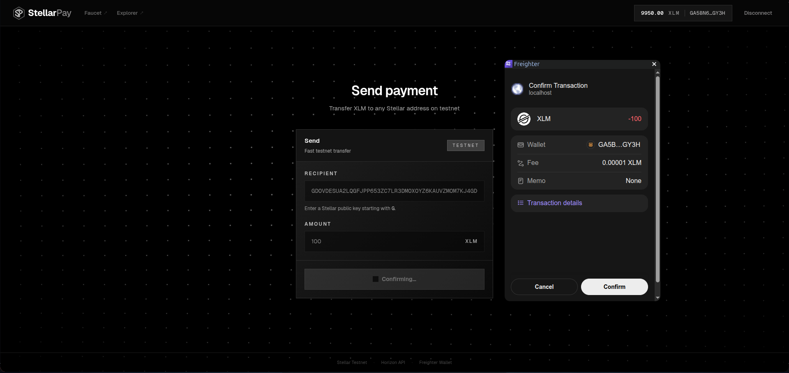
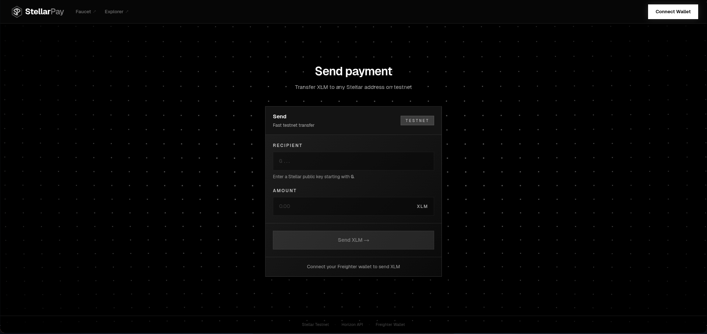
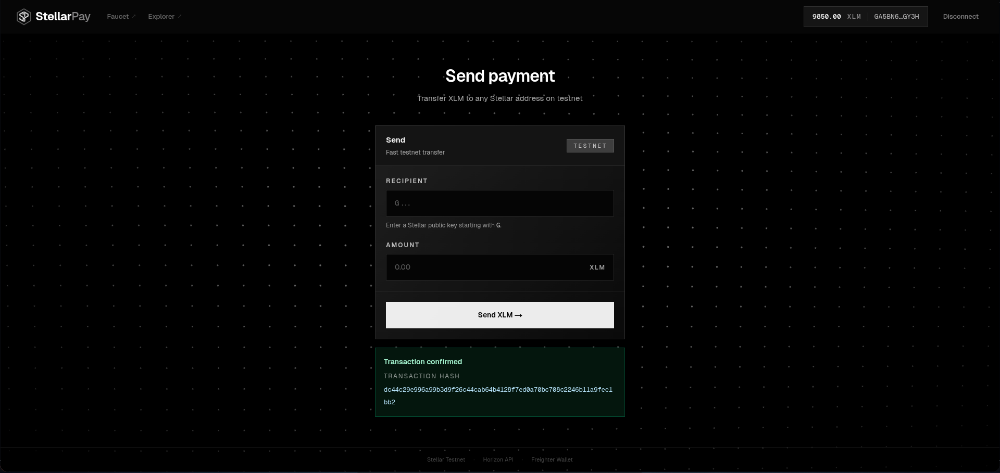

<div align="center">
  
  <h1>StellarPay — Stellar Testnet Payment dApp</h1>
  <p>A sleek, deeply customized payment dApp built on the Stellar testnet.</p>
</div>

---

## Overview
Connect your Freighter wallet, view your real-time XLM balance, and seamlessly send native payments to any valid Stellar address.

This application focuses on fulfilling the core requirements of **Level 1 – White Belt** of the Stellar Connect Wallet Challenge, while elevating the UI to a premium, "Web3-native" aesthetic with dynamic particle-mesh backgrounds, glassmorphic frosted cards, and sharp monochromatic contrast.

## Features
- **Wallet Connection:** Secure connection handling with the Freighter browser extension.
- **Real-Time Balance:** Instantly queries the Stellar Testnet Horizon API to display the active XLM balance of the connected account.
- **Native Payments:** Send XLM to any public address. The dApp manages the full transaction lifecycle: from building the XDR, to requesting the user's signature via Freighter, to submitting the payload to the network.
- **Transaction Feedback:** Success/failure states are distinctly visualized. Successful trades provide a direct, clickable link to the transaction hash on **Stellar Expert**.
- **Validation:** Automatic validation for valid Stellar addresses (starting with 'G', exactly 56 characters) and non-negative amounts.
- **Security via Delegation:** No private keys are ever stored or handled locally. All transaction signing is safely delegated to the Freighter extension.

## Screenshots

<div align="center">
    
    <br/><br/>
    
    <br/><br/>
    
</div>

## Tech Stack
| Layer       | Technology                              |
|-------------|------------------------------------------|
| **Framework**   | [Next.js (App Router)](https://nextjs.org) |
| **Language**    | TypeScript / JavaScript                  |
| **Styling**     | [Tailwind CSS v4](https://tailwindcss.com) (Custom animations & mesh grids) |
| **Blockchain**  | [`@stellar/stellar-sdk`](https://stellar.org) |
| **Wallet**      | [`@stellar/freighter-api`](https://freighter.app) |

## Getting Started

### Prerequisites
1. Node.js (v18 or higher recommended)
2. The [Freighter Browser Extension](https://www.freighter.app/) installed and configured for **Testnet**
3. Testnet XLM (use [Friendbot](https://laboratory.stellar.org/#account-creator?network=test) to fund your account)

### Local Setup
```bash
# 1. Clone the repository
git clone <repository-url>
cd <repository-directory>

# 2. Install dependencies
npm install

# 3. Start the dev server
npm run dev

# 4. Access the application
# Navigate to https://localhost:3000 in your browser
```

## Network
This dApp connects exclusively to the **Stellar Testnet**.
- **Horizon URL**: `https://horizon-testnet.stellar.org`
- **Passphrase**: `Test SDF Network ; September 2015`

## License
MIT
